[xleo.nl](https://xleo.nl)

> Discord bot developer. Most of what I ship lives in Python and JavaScript, 
> from alliance management bots to a terminal based movie watcher. 
> Also into Discord client modding — Equicord userplugins and shelter plugins.

<samp>python &nbsp; javascript &nbsp; typescript &nbsp; node &nbsp; shell &nbsp; git &nbsp; linux</samp>

**[mov-watch](https://github.com/leoallday/mov-watch)** &nbsp;·&nbsp; <samp>python</samp> 
A terminal based movie watcher. The flagship repo, 
12 stars and counting.

**[pinnedServers](https://github.com/leoallday/pinnedServers)** &nbsp;·&nbsp; <samp>typescript, equicord</samp> 
An Equicord userplugin that pins favourite servers to the top 
of the server list, where they stay.

**[shelter-plugins](https://github.com/leoallday/shelter-plugins)** &nbsp;·&nbsp; <samp>javascript, shelter</samp> 
A collection of shelter plugins for the Discord web client, 
with a live preview page.

**[Whiteout-Survival-Discord-Bot](https://github.com/leoallday/Whiteout-Survival-Discord-Bot)** &nbsp;·&nbsp; <samp>javascript</samp> 
Whiteout Survival alliance bot: management commands, event reminders 
and gift code redemption.

No third-party widgets. No stats cards that go down at 2am. Every graphic 
on this page is drawn by a script in this repo, straight from the GitHub API 
and refreshed daily. The portrait up top is my own avatar, rendered as text.
